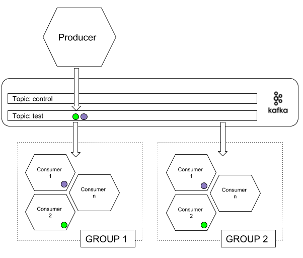

# Microservice Consumer

This microservice subscribe control topic and test topic and count the number of events that has received.

**SERVICE UNDER CONSTRUCTION: documentation may not match with functionality 100%**

# Quickstart

Install de service and start this service.

```
git clone https://github.com/sbonacho/consumer.git
cd consumer
mvn spring-boot:run
```

Configuration for the topics in application.yml or passed by command line (Spring config)

```
kafka:
  bootstrap-servers: 172.16.123.1:9092

connector:
  topics:
    control: control
    test: test
  group: clients
```

# Executing a Test

- When a test is launched in the producer, consumer has to consume all message and check no message has lost.
- Consumer receive configuration via control topic.
- Is possible to start as many consumers as you want for the test


 
## Control message Description

```
{  
   "messages":1000,
   "threads":2,
   "length":[ 50 ],
   "producerConfig":{  
      "acks":1,
      "bootstrap.servers":"localhost:9092"
   },
   "topic":"test",
   "waitForAck":true
}
```

- **messages:** The number of total messages/events generated in this load test execution.
- **threads:** Number of thread used for the tests
- **length:** Length of the messages/events, [min, max]: for example: [1, 500] messages from 1 to 500 bytes. [100] messages of 100 bytes.
- **topic:** Topic used to send the messages
- **waitForAck:** default(false): if true each thread is going to wait for the ack response of kafka broker.
- **producerConfig**: All the configuration of the kafka broker to be stressed. Is possible to configure all producer parameters https://kafka.apache.org/documentation/#producerapi


# Running the service

```
mvn package
java -jar target/consumer-0.1.0.jar
```

or

```
mvn spring-boot:run
```

## The run.sh Script

This script is used to wrap how to start/stop the microservice. Write the way you want to start/stop the microservice

# Docker Generation

```
mvn install dockerfile:build
```

## Running docker service

This command starts the service with domain-clients name

```
docker run --rm -dit -p 8080:8080 --name domain-clients sbonacho/consumer
```

Watching logs

```
docker logs consumer -f
```

Stopping the service

```
docker stop consumer
```